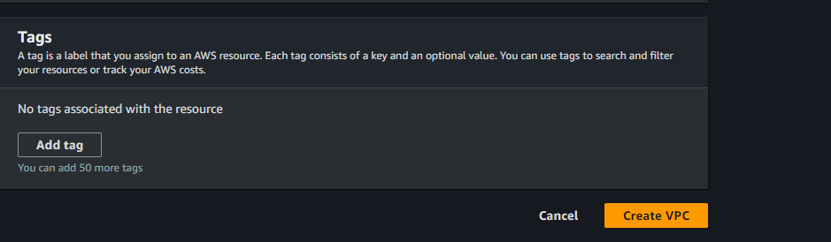
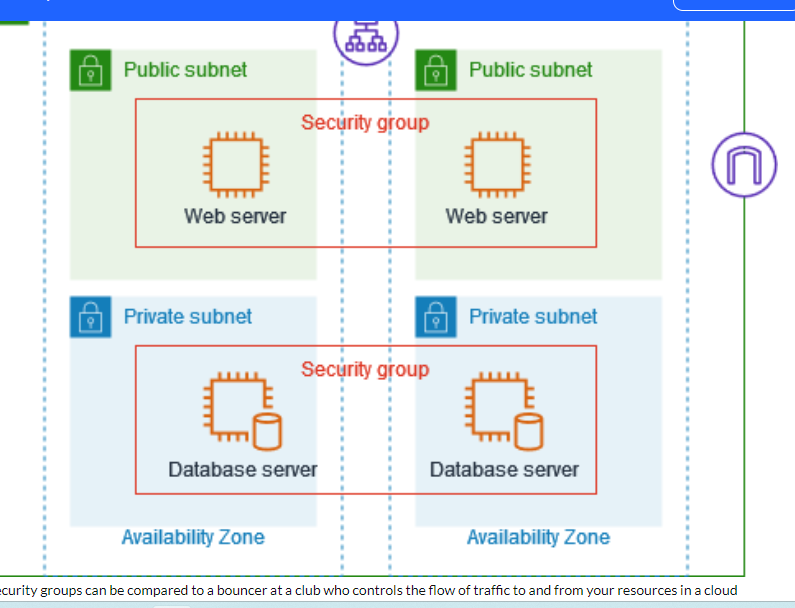
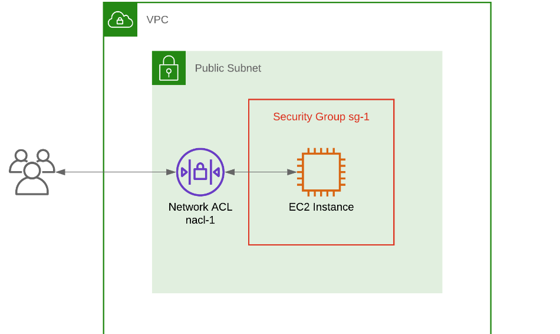

# AWS-Networking-implementation-VPC-Subnets-IG-NAT-Routing-
AWS Networking implementation

# AWS Networking implementation (VPC, Subnets, IG, NAT, Routing)

## In this project we would master the art of AWS networking implementation, including VPC, subnets, internet gate in this project.
### This project will enabling you to design and deploy scalable and secure cloud architectures.
##  AWS VPC Creation and Subnet Configuration
### When you log into your AWS you see Welcome to AWS networking! 
### This field uses Virtual Private Clouds (VPCs) and subnets to create the backbone of your cloud- based projects.
### This project will simplify the complex aspects of AWS net, highlighting the useful and adaptable nature of VPCs and subnets.
### Whether you are a starter or a long time AWS users this project will make us understand PVCs and subnet better.
	

# Amazon PVC

## What is Amazon PVC :  An Amazon Virtual Private Cloud (VPC) is like your own private section of the Amazon cloud, where we can place and manage our resources.

## For example, servers or databases.
### We can control who and what can go in and out, just like a gated community.
### The essential steps to create a pvc  and configuring core network service.
1.	The default PVC
2.	Creating a new PVC
3.	 Creating and configuring subnets

•	 The Default VPC is like a starter pack provided by Amazon for your cloud resources.  
•	 It's a pre-configured space in the Amazon cloud where we can immediately start deploying our applications or  services. 
•	 Default configuration settings can be changed according to out need.

## Creating a new VPC
### As we want to learn step by step and observe the components, choose the "VPC only" option, we'll use the "VPC and more" option later. Enter "first-vpc" as the name tag and "10.0.0.0/16" as the IPv4 CIDR. The "10.0.0.0/16" will be the primary IPv4 block and we can add a secondary IPv4 block e.g., "100.64.0.0/16". The use case of secondary CIDR block could be because you're running out of IPs and need to add additional block, or there's a VPC with overlapping CIDR which you need to peer or connect. 

### Leave the tags as defaults

### As soon as VPC is created, it is assign with VPC ID and there is route table created 

## Creating and configuring Subnet

### What is subnet? Subnets are like smaller segments within a VPC that help you organize and manage our resources. 
### Subnets are like dividing an office building into smaller sections, where each section represents a department. 

 
## Create subnet and enter the subnet settings

### Enter the subnet setting detail, don’t click the create subnet, click on add new subnet button to add the remaining subnet and after this click create subnet.

### Once we are done, we would see all created subnet on the console.

### Create a subnet and select a desire vpc.

### Understanding Public and Private Subnets in AWS VPC

### In the world of AWSVPC, think of subnets as individual plots in your land (VPC). Some of these plots (subnets) have direct road access (internet access) - these are public subnets. Others are more private, tucked away without direct road access - these are private subnets.

### Creating a Public Subnet Creating a public subnet is like creating a plot of land with direct road (internet) access.

### Follow this steps

### Go to the AWS VPC page.

### Find "Subnets', click on it, then click 'Create subnet.
### Give this new plot a name, select the big plot (VPC) you want to divide, and leave the IP settings as they are.
### Attach an Internet Gateway to this subnet to provide the road (internet] access.
### Update the route table associated with this subnet to allow traffic to flow to and from the internet.

## Creating a Private Subnet

### Creating a private subnet is like creating a secluded plot without direct road (internet) access. Here's how you do it:

## Go to the AWS VPC page.

### Find "Subnets, click on it, then click 'Create subnet. Give this new plot a name, select the big plot (VPC) you want to divide, and leave the IP settings as they are.
### Don't attach an Internet Gateway to this subnet, keeping it secluded.

### The route table for this subnet doesn't allow direct traffic to and from the internet.
### Working with Public and Private Subnets
### Public subnets are great for resources that need to connect to the internet, like web servers. Private subnets are great for resources that you don't want to expose to the internet, like databases.
### Understanding public and private subnets helps you to organize and protect your AWS resources better. Always remember, use public subnets for resources that need internet access and private subnets for resources that you want to keep private.

### Internet Gateway and Routing Table

## Introduction to Internet Gateway and Routing Table

### Just like in a real city, in our virtual city (VPC), you need roads (Internet Gateway) for people (data) to come and go. And you also need a map or GPS (Routing Table) to tell people (data) which way to go to reach their destination.

## What is an Internet Gateway?

### An Internet Gateway in AWS is like a road that connects your city (VPC) to the outside world (the internet). Without this road, people (data) can't come in or go out of our city (VPC).

### Technically, the subnets are still private. You'll need these to make it work as public subnets:
### An Internet Gateway (IGW) attached to the VPC
### Route table with default route towards the IGW

### Step to create internet gateway

### Go to VPC > Internet gateways and click "Create internet gateway"

### We want the private subnets to be private, we don't want the private subnets to have a default route to the Internet. For that, we'll need to create a separate route table for the public subnets.

## What is a Routing Table?

### A Routing Table is like a map or GPS. It tells the people (data) in your city (VPC) which way to go to reach their destination. For example, if the data wants to go to the internet, the Routing Table will tell it to take the road (Internet Gateway) that you built.

### Creating and Configuring Routing Tables Now that we have our entrance and exit (Internet Gateway), we need to give directions to our resources. This is done through a Routing Table. It's like a map, guiding your resources on how to get in and out of your

### VPC Let's go to the route table menu and create a route table for the public subnets.
### Put a name for the route table as you desire test-vpc-public-rtb and select the desired vpc - "test-vpc".

### A route table specifies how packets are forwarded between the subnets within your VPC, the internet, and your VPN connection.

### Edit the route table and add a default route

### That's it! Now that the VPC is ready. you can run an EC2 instance in public subnets if they need Internet access or in private subnets if they don't.

### Edit subnet association 

### Route table

### We will revisit the importance of NAT gateway in the context of private subnet.
### We will also share some best practices when working with private subnet and NAT Gateway in AWS.

### Security Group And Network ACLs (Network access control list)

### Security group and ACLs are both important tools for securing our network on the AWS cloud but they serve different purposes and have different use cases.

## Security Groups

### Note:
### test-vpc-public-rtb:
### A route table with a target to Internet gateway is a public route table.
### test-vpc-private-rtb:
### A route table with a target to NAT gateway is a private route table.
### I will also create the route table for for private but subnets and routes are not yet been attached to it just only created.

## NAT Gateway and Private Subnets

### Introduction to Private Subnets and NAT Gateway

### In your AWS Virtual Private Cloud (VPC), private subnets are secluded areas where you can place resources that should not be directly exposed to the internet. But what if these resources need to access the internet for updates or downloads? This is where the NAT Gateway comes in. 

### A private subnet in AWS is like a secure room inside our house (VPC) with no windows or doors to the street (internet). Anything we place in this room (like a database) is not directly accessible from the outside world.

### Understanding NAT Gateway

### A Network Address Translation (NAT) Gateway acts like a secure door that only opens one way. It allows your resources inside the private subnet to access the internet for things like updates and downloads, but it doesn't allow anything from the internet to enter your private subnet.

### A Network Address Translation (NAT) allows instances in your private subnet to connect to outside services like Databases but restricts external services to connecting to these instances.

### Creating a NAT Gateway and Linking It to a Private Subnet

### We'll guide you step-by-step on how to create a NAT Gateway and how to link it to your private subnet. We'll also cover how to configure a route in your routing table to direct outbound internet traffic from your private subnet to the NAT Gateway.

## Follow this steps

### Go to VPC > NAT Gateways and click "Create NAT Gateway"
### Network ACLs (Access Control Lists) can be likened to a security guard for a building, responsible for controlling inbound and outbound traffic at the subnet level in a cloud computing environment. Imagine we have a building with multiple rooms and entry points, and we want to ensure that only authorized individuals can enter and exit the rooms. In this analogy, the building represents our subnet, and the security guard represents the network ACL.
 
### Similar to a security guard who verifies IDs and credentials before allowing entry into the building, a network ACL examines the IP addresses and ports of incoming and outgoing network traffic. It serves as a virtual barrier or perimeter security, defining rules that dictate which types of traffic are permitted or denied.
 

## Network Access Control List{NACLs}

### For instance, a network ACL can be configured to allow incoming SSH (Secure Shell) traffic (on port 22) to a specific subnet, while blocking all other types of incoming traffic. It can also permit outgoing traffic from the subnet to a specific range of IP addresses on a certain port, while disallowing any other outbound connections.

### By implementing these rules, network ACLs act as a crucial line of defense, safeguarding your entire subnet from unauthorized access and malicious attacks. They ensure that only traffic meeting the specified criteria is allowed to enter or exit the subnet, while blocking or rejecting any unauthorized or potentially harmful traffic.
 
### It's important to note that network ACLs operate at the subnet level, meaning they control traffic for all instances within a subnet. They provide a broader scope of security compared to security groups, which operate at the instance level. Network ACLs are typically stateless, meaning that inbound and outbound traffic is evaluated separately, and specific rules must be defined for both directions.
 
### In summary, network ACLs function as a virtual security guard for our subnet, regulating inbound and outbound traffic at a broader level.

### They operate similarly to a security guard who controls access to a buildingby examining IDs, ensuring that only traffic meeting the defined rules is allowed to pass, and thereby providing protection against unauthorized access and malicious activities for your entire subnet.

### VPC Peering is a networking feature that allows you to connect two Virtual Private Clouds (VPCs) within the same cloud provider's network or across different regions. VPC Peering enables direct communication between VPCs, allowing resources in each VPC to interact with each other as if they were on the same network.

### It provides a secure and private connection without the need for internet access. VPC Peering is commonly used to establish connectivity between VPCs in scenarios such as multi-tier applications, resource sharing, or data replication.

## Benefits of VPC Peering

### Simplified Network Architecture: VPC Peering simplifies network design by enabling direct communication between VPCs, eliminating the need for complex networking configurations.

### Enhanced Resource Sharing: With VPC Peering, resources in different VPCs can communicate seamlessly, allowing for efficient sharing of data, services, and applications. 

### Increased Security: Communication between peered VPCs remains within the cloud provider's network, ensuring a secure and private connection.

## Low Latency and High Bandwidth: 

### VPC Peering enables high-performance networking with low latency and high bandwidth, improving application performance.

### Cost Efficiency: Utilizing VPC Peering eliminates the need for additional networking components, reducing costs associated with data transfer and network infrastructure. 

VPC PEERING

### Introduction to VPN Connections

### VPN (Virtual Private Network) connections establish a secure and encrypted communication channel between your on-premises network and a cloud provider's network, such as a VPC. VPN connections enable

### secure access to resources in the cloud from remote locations or connect on-premises networks with cloud resources.

## There are two primary types of VPN connections:

### 1 Site-to-Site VPN: Site-to-Site VPN establishes a secure connection between your on-premises network and the cloud provider's network.
### 2 It allows communication between your on-premises resources and resources in the VPC securely and privately. 

### This type of VPN connection is commonly used in hybrid cloud architectures.
 
### AWS Client VPN: AWS Client VPN provides secure remote access to the cloud network for individual users or devices. 

### Enables secure connectivity for remote employees, partners, or contractors to access resources in the VPC securely.

## Benefits of VPN Connections

### Secure Remote Access: VPN connections enable secure access to resources in the cloud network for remote users or devices, ensuring data privacy and protection.

### Data Encryption: VPN connections encrypt the data transmitted between your on-premises network and the cloud network, providing a secure channel for data transfer.

### Flexibility and Mobility: VPN connections allow authorized users to securely access cloud resources from any location, promoting flexibility and mobility in accessing critical applications and data.

### Hybrid Cloud Connectivity: VPN connections play a vital role in establishing secure and reliable connectivity between our on-premises network and cloud resources, facilitating hybrid cloud architectures and seamless integration.
 
### In conclusion

### In summary, VPC Peering enables direct communication between VPCs, simplifying network architecture and enhancing resource sharing within the cloud network. VPN connections establish secure tunnels between on-premises networks and the cloud, enabling secure remote access and facilitating hybrid cloud connectivity.

### We can boldly see that both VPC Peering and VPN connections contribute to building secure, scalable, and efficient network infrastructures in cloud environments.

